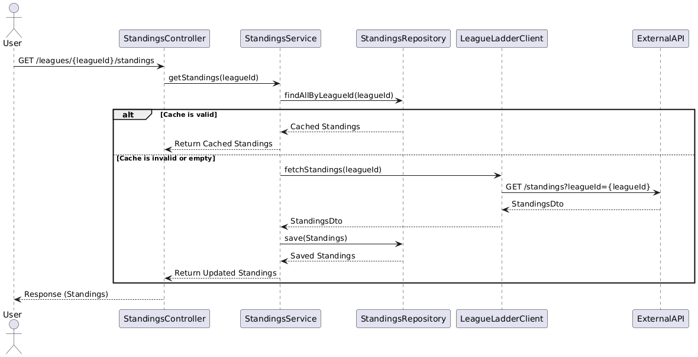

# League Ladder Service

## Overview
The **League Ladder Service** is a Spring Boot-based application designed to manage and provide league standings. It integrates with [external API](https://apifootball.com/documentation/#Standings) to fetch league standings and caches the data for efficient retrieval. The project is containerized using Docker and includes CI/CD pipelines for automated builds, vulnerability scanning, and deployment.

## Features
- Fetch and cache league standings from external API.
- Cache validation to ensure data freshness.
- Exposes a REST API for accessing league standings.
- Kubernetes deployment with `LoadBalancer` service type for external access.
- CI/CD pipeline with Jenkins for automated builds, testing, and deployment.
- Security and quality checks using Trivy, SonarQube, and OWASP Dependency-Check.

## Technologies Used
- **Languages**: Java, SQL
- **Frameworks**: Spring Boot, Maven
- **Containerization**: Docker
- **Orchestration**: Kubernetes
- **CI/CD**: Jenkins
- **Security Tools**: Trivy, OWASP Dependency-Check
- **Code Quality**: SonarQube

### Running the Application via JAR File
   ```bash
   # Build the application
   mvn clean package
   # Run the application
   java -jar target/league-ladder-0.0.1-SNAPSHOT.jar
    ```
   
## Accessing the API
Once the application is running, you can access the API at http://localhost:8080.

### API Endpoints
| Endpoint              | Method | Description                              |
|-----------------------|--------|------------------------------------------|
| /, /leagues           | GET    | Fetches all available leagues.           |
| /standings/{leagueId} | GET    | Fetches standings for a specific league. |

## Sequence Diagram



## Prerequisites
- Java 21
- Maven
- Docker
- Kubernetes cluster
- Jenkins (configured with SonarQube and Trivy)

## Project Structure
- `k8s/`: Kubernetes deployment and service configurations.
- `java/dev/kartikdewal/leagueladder/`: Application source code.
- `Jenkinsfile`: CI/CD pipeline definition.

## Setup and Deployment

### 1. Build and Run Locally
```bash
# Build the application
mvn clean package

# Build the Docker image
docker build -t league-ladder:latest .

# Run the Docker container
docker run -p 8080:8080 league-ladder:latest
```

### 2. Deploy to Kubernetes
1. Apply the deployment and service configurations:
   ```bash
   kubectl apply -f k8s/deployment.yaml
   kubectl apply -f k8s/service.yaml
   ```
2. Access the service using the external IP provided by the `LoadBalancer`.

### 3. CI/CD Pipeline
The Jenkins pipeline (`Jenkinsfile`) includes the following stages:
- **Build Docker Image**: Builds the application Docker image.
- **Trivy Scan**: Scans the Docker image for vulnerabilities.
- **SonarQube Analysis**: Performs static code analysis.
- **OWASP Dependency-Check**: Scans for vulnerable dependencies.
- **Test**: Runs unit tests.
- **Package**: Packages the application.
- **Deploy**: Deploys the application to Kubernetes.

## Configuration
- Environment variables are managed using a Kubernetes ConfigMap (`league-ladder-config`).
- Resource limits and requests are defined in the Kubernetes deployment file.

## Security and Quality
- **Trivy**: Scans Docker images for vulnerabilities.
- **SonarQube**: Ensures code quality and detects bugs.
- **OWASP Dependency-Check**: Identifies vulnerable dependencies.

## License
This project is licensed under the MIT License. See the `LICENSE` file for details.